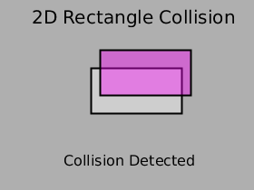
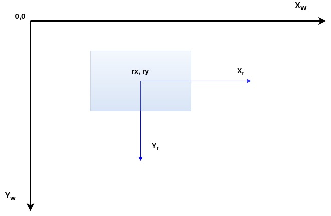
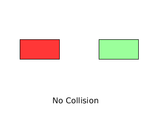
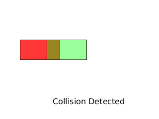
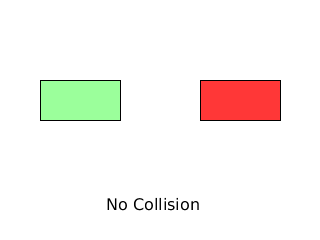
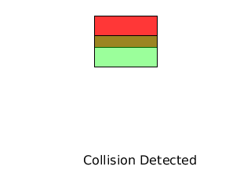

# 2D Collision Detection Between Two Rectangles

Objective: Write a program to detect when two rectangles collide.  

  

## Getting Started 

We first need to understand some basic information about the drawing window and how rectangle objects are represented. The list below contains the items of interest. 

- Drawing Window Attributes
   - Coordinate System
      - Origin location
      - Direction of x, y axes
   - Size
      - Width
      - Height

- Rectangle Attributes
   - Location 
      - with respect to drawing window reference point
      - with respect to rectangle object
         - center
         - corner
   - Size
      - width
      - height

  

## Drawing Window Coordinate System

The drawing window has a two-dimensional Cartesian coordinate system. The origin is located in the upper left corner, with the direction of the positive Xw and Yw axes shown in Figure 1. The drawing window has a width and a height. The *x* coordinates range in value from 0 to width-1, and the *y* coordinates range in value from 0 to height-1. 

Any objects drawn in the window each have their own local coordinate frames as well. The rectangle in Figure 1 has a local coordinate system, labeled Xr and Yr in Figure 1.  When drawing an object, we need to know the orientation (rotation) of the objbect's local coordinate frame relative to the drawing window reference frame. All our rectangles will be axis-aligned, meaning the rectangle's local axes are parallel to the drawing window axes. In other words, our objects are not rotated with respect the drawing window reference frame.   

Figure 1: Rectangle within drawing window  

## Rectangle Attributes

In order to draw a rectangle, we need to its location and size. A rectangle's size is specified by its width and height. Location (rx, ry) is specified in relation to a reference point, the drawing window origin. The location may be a rectangle's center point or a corner point. The Figure 2 rectangle coordinates (rx,ry) specify the location of the rectangle's center relative to the drawing window origin point.  

Figure 2: Rectangle Attributes  

For collision detection, we must have some way of specifying the location of the rectangle's outer edges: left side, right side, top, and bottom. With (rx,ry) representing the rectangle's center, the left side is located at rx - rectangle width/2. The right side is located at rx + rectangle width/2. The top edge is located at ry - rectangle height/2, and the bottom is located at ry + rectangle height/2. Figure 3 shows the coordinates of each of the rectangle's corners.   

Figure 3: Rectangle Corner Coordinates  

### Case 1 - Horizontally Aligned Rectangles

Figure 4 shows two horizontally aligned rectangles. If the green rectangle starts moving left towards the red rectangle, how will we detect a collision?

  
Figure 4: No collision  

Figure 5 shows two horizontally aligned rectangles that overlap. At some point, the red rectangle's right side collided with the green rectangle's left side. We see that after the collision, the left side of the green triangle is at an x position that is less than the right side of the red triangle. We now have a condition that specifies a collision: left side of green is less than right side of red. 

  
Figure 5: Collision after green moved left  

We can further refine this condition to recognize that collision takes place when their edges make contact, i.e. left side green equals right side red. 

> If right side red less than or equal to left side green 

 Is this condition alone enough to determine a collision? Figure 6 illustrates a case where this test condition is true, but there is no collision.   

  
Figure 6: No collision case where green left side <= red right side  

We need to add the condition that the right side of the green cannot be less than the left side of the red.  

> If right side red less than or equal to left side green AND right side green less than left side red

Next we consider vertical movement.

  

### Case 2 - Vertically Aligned Rectangles

Next, we consider the case of vertically aligned rectangles. Figure 7 shows two vertically aligned, overlapping rectangles. We can see that collision occurs when the green rectangle's top is less than or equal to the red rectangle's bottom edge and the green rectangle's bottom is greater than the red rectangle's top.  

  
Figure 7: Vertically Aligned Collision  

We add these conditions to our psuedocode.

> If right side red less than or equal to left side green 
> AND right side green less than left side red 
> AND the green rectangle's top is less than or equal to the red rectangle's bottom 
> AND the green rectangle's bottom is greater than the red rectangle's top.

  

### Program Solution

The programming solution is found in the Processing sketch [rectangle_collision.pde]. Note that we have tested rectangles of the same size. Will this code work rectangles of various sizes? This is left as an exercise to the reader.