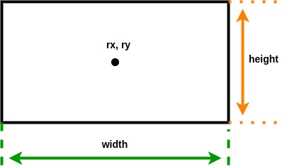
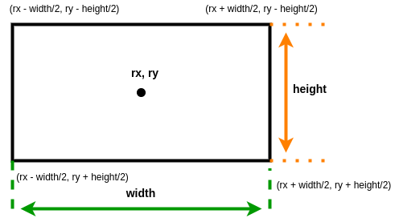
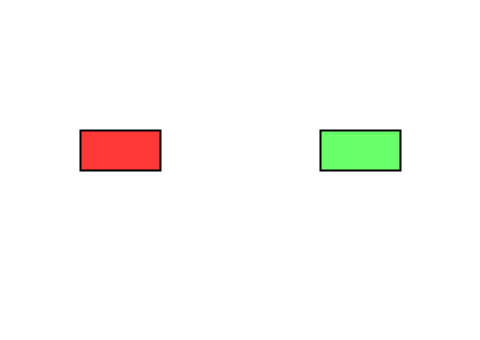
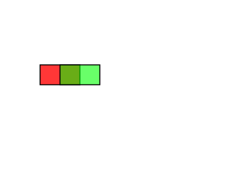
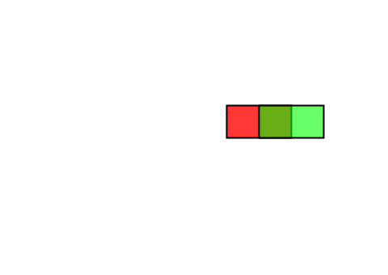
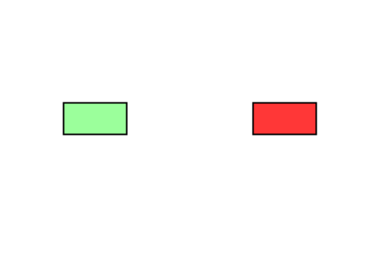
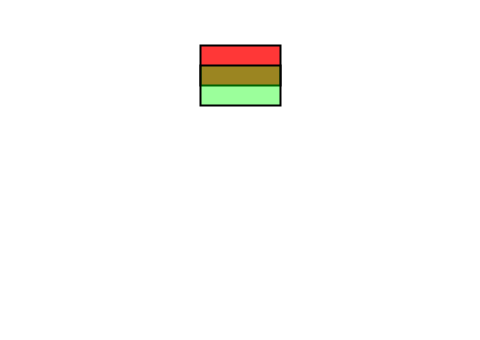

# 2D Collision Detection Between Two Rectangles

Let's start with the simplest case of detecting a collision between two rectangles. We first need to understand some basics about the drawing window and how rectangle objects are represented.

- Drawing Window Attributes
   - Coordinate System
      - Origin location
      - Direction of x, y axes
   - Size
      - Width
      - Height

- Rectangle Attributes
   - Location 
      - with respect to drawing window reference point
      - with respect to rectangle object
         - center
         - corner
   - Size
      - width
      - height

</br></br>

## Drawing Window Coordinate System

The drawing window has a two-dimensional Cartesian coordinate system. The origin is located in the upper left corner, with the direction of the positive X<sub>w</sub> and Y<sub>w</sub> axes shown in Figure 1. The drawing window has a width and a height. The x coordinates range in value from 0 to width-1, and the y coordinates range in value from 0 to height-1. 

Any objects drawn in the window each have their own local coordinate frames as well. The rectangle in Figure 1 has a local coordinate system, labeled X<sub>r</sub> and Y<sub>r</sub> in Figure 1.  When drawing an object, we need to know the orientation (rotation) of the objbect's local coordinate frame relative to the drawing window reference frame. All our rectangles will be axis-aligned, meaning the rectangle's local axes are parallel to the drawing window axes. In other words, our objects are not rotated with respect the drawing window reference frame. </br></br>


Figure 1: Rectangle within drawing window</br></br>

## Rectangle Attributes

In order to draw a rectangle, we need to know its location and its size. A rectangle's size is specified by its width and height. Location is specified in relation to a reference point, the drawing window origin. The Figure 2 rectangle coordinates (rx,ry) specify the location of its center relative to the drawing window origin point.</br></br>



Figure 2: Rectangle Attributes</br></br>

Finally, for collision detection, we must have some way of specifying the location of the rectangle's outer edges: left side, right side, top, and bottom. With (rx,ry) representing the rectangle's center, the left side is located at rx - rectangle width / 2. The right side is located at rx + rectangle width/2. The top edge is located at ry - rectangle height/2, and the bottom is located at ry + rectangle height/2. Figure 3 shows the coordinates of each of the rectangle's corners. </br></br>



Figure 3: Rectangle Corner Coordinates</br></br>


### Case 1 - Horizontally Aligned Rectangles

Figure 4 shows two horizontally aligned rectangles. If the green rectangle starts moving left towards the red rectangle, how will we detect a collision?

</br></br>
Figure 4: No collision</br></br>

Figure 5 shows two horizontally aligned rectangles that overlap. At some point, the left side of the green rectangle collided with the right side of the red. We see that after the collision, the left side of the green triangle is at an x position that is less than the right side of the red triangle. We now have a condition that specifies the possibility of a collision: left side of green is less than right side of red

</br></br>
Figure 5: Collision after green moved left</br></br>

Let's now consider what happens when the red rectangle in Figure 4 starts moving right toward the green rectangle. Figure 6 shows these two rectangles overlapping. At some point, the right side of the red rectangle collided with the left side of the green triangle. This gives the same collision detection condition specification: right side of red 1 greater than left side of green.</br></br>

</br></br>
Figure 6: Collision after red moved right</br></br>

The program horizontal_left.pde is shown below. The left & right arrows move the green rectangle horizontally. The message "collision detection" is printed when the left side the green rectangle (rbx-rwidth/2) is less than the right side of the red rectangle (rax + rwidth/2).

```java
/* Red rectangle a is stationary.
*  Left/right arrow key moves green rectangle b
*/

int rwidth = 80;
int rheight = 40;
int rax, ray, rbx, rby;     
int dx = rwidth/4;

color raColor = color(255,0,0,200);
color rbColor = color(0, 255,0,100);

void setup(){
  size(480, 340);
  strokeWeight(2);
  rectMode(CENTER);
  rax = width/4;
  rbx = width*3/4;
  ray = height/2 - rheight/2;
  rby = height/2 - rheight/2;
}

void draw(){
  background(255);
  fill(raColor);
  rect(rax, ray, rwidth, rheight);
  fill(rbColor);
  rect(rbx, rby, rwidth, rheight);
  
  // collision detection
  // left side of rectangle b is rbx - rwidth/2
  // right side of rectangle a is rax + rwidth/2
  // if (left side of b) is less than (right side of a)
  if( (rbx - rwidth/2) < (rax + rwidth/2)){
    println("collision detected");
  }
}

void keyPressed()
{
  if(keyCode == 37){   // left arrow
    rbx -= dx;
  }
  else if(keyCode == 39){  // right arrow
    rbx += dx;
  }
}
```

The above condition alone is not enough to specify a collision. Look at the rectangles in Figure 7. The green rectangle is not overlapping with the red. There is no collision, but our logic: "if left side of green rectangle is less than right side of red rectangle, then there is a collision" is incorrect. We need to amend that condition. Notice in Figures 5 and 6, where there was a collision, the left side of the red rectangle is less than the right side of the green rectangle. Our horizontal collision detection requires that both conditions are true. 

</br></br>
Figure 7: No collision</br></br>


The program horizontal_collision.pde implements the amended condition shown below.

```java
  // collision detection
  // left side of rectangle b is rbx - rwidth/2
  // right side of rectangle a is rax + rwidth/2
  // if (left side of b) is less than (right side of a) 
  // and if (right side of b) is greater than (left side of a)
  if( (rbx - rwidth/2) < (rax + rwidth/2)
      && (rbx + rwidth/2) > (rax - rwidth/2)){
    println("collision detected");
  }
```

</br></br>

### Case 2 - Vertically Aligned Rectangles

Next, we consider the case of vertically aligned rectangles. Figure 8 shows two vertically aligned, overlapping rectangles. We can see that collision occurs when the green rectangle's top is less than the red rectangle's bottom edge and the green rectangle's bottom is greater than the red rectangle's top.</br></br>

</br></br>
Figure 8: Vertical Collision</br></br>


The program vertical_collision.pde is shown below. The up and right arrow keys move the green rectangle vertically. Messages are displayed to indicate whether or not a collision is detected.

```java
/* Red rectangle a is stationary.
*  Up/down arrow key moves green rectangle b
*/

int rwidth = 80;
int rheight = 40;
int rax, ray, rbx, rby;     
int dy = rheight/4;

color raColor = color(255,0,0,200);
color rbColor = color(0, 255,0,100);

void setup(){
  size(480, 340);
  strokeWeight(2);
  rectMode(CENTER);
  rax = width/2;
  rbx = width/2;
  ray = height/4 - rheight/2;
  rby = height*3/4 - rheight/2;
}

void draw(){
  background(255);
  fill(raColor);
  rect(rax, ray, rwidth, rheight);
  fill(rbColor);
  rect(rbx, rby, rwidth, rheight);
  
  /* vertical collision detection
  *  top of rectangle b is rby - rheight/2
  *  bottom of rectangle a is ray + rheight/2
  *
  *  if(top of rectangle b < bottom of rectangle a
  *     and bottom of rectangle b > top of rectangle a)
  *  then there is a collision
  */
  
  if( (rby - rheight/2) < (ray + rheight/2)
      && (rby + rheight/2) > (ray - rheight/2)){
    println("collision detected");
  }
  else{
    println("no collision");
  }
}

void keyPressed()
{
  if(key == 'f'){
    saveFrame("vert-####.png");
  }
  if(keyCode == 38){   // up arrow
    rby -= dy;
  }
  else if(keyCode == 40){  // down arrow
    rby += dy;
  }
}

```

### Case 3 - Putting it all together

The sketch rectangle_collision.pde combines both the horizontal and vertical collision conditions. Note that we have tested rectangles of the same size. Will this code work rectangles of various sizes? This is left as an exercise to the reader.

```java
/* Red rectangle a is stationary.
*  Arrow keys move green rectangle b
*/

int rwidth = 80;
int rheight = 40;
int rax, ray, rbx, rby;     
int dy = rheight/4;
int dx = rwidth/4;

color raColor = color(255,0,0,200);
color rbColor = color(0, 255,0,100);

void setup(){
  size(480, 340);
  strokeWeight(2);
  rectMode(CENTER);
  rax = width/2;
  rbx = width/2;
  ray = height/2;
  rby = height*3/4 - rheight/2;
}

void draw(){
  background(255);
  fill(raColor);
  rect(rax, ray, rwidth, rheight);
  fill(rbColor);
  rect(rbx, rby, rwidth, rheight);
  
  /* vertical collision detection
  *  top of rectangle b is rby - rheight/2
  *  bottom of rectangle a is ray + rheight/2
  *
  *  if(top of rectangle b < bottom of rectangle a
  *     and bottom of rectangle b > top of rectangle a)
  *  then there is a collision
  */
  
  /* horizontal collision detection
  * left side of rectangle b is rbx - rwidth/2
  * right side of rectangle a is rax + rwidth/2
  * 
  * if (left side of b) is less than (right side of a) 
  *   and if (right side of b) is greater than (left side of a)
  * then there is a collision
  */
  
  if( (rby - rheight/2) < (ray + rheight/2)
      && (rby + rheight/2) > (ray - rheight/2)
      && (rbx - rwidth/2) < (rax + rwidth/2)
      && (rbx + rwidth/2) > (rax - rwidth/2))
  {
    println("collision detected");
  }
  else{
    println("no collision");
  }
}

void keyPressed()
{
  if(keyCode == 37){   // left arrow
    rbx -= dx;
  }
  if(keyCode == 38){   // up arrow
    rby -= dy;
  }
  else if(keyCode == 39){  // right arrow
    rbx += dx;
  }
  else if(keyCode == 40){  // down arrow
    rby += dy;
  }
}

```

Note that the code does not detect a collision when boundaries first collide, i.e. when the edges collide before overlapping.
